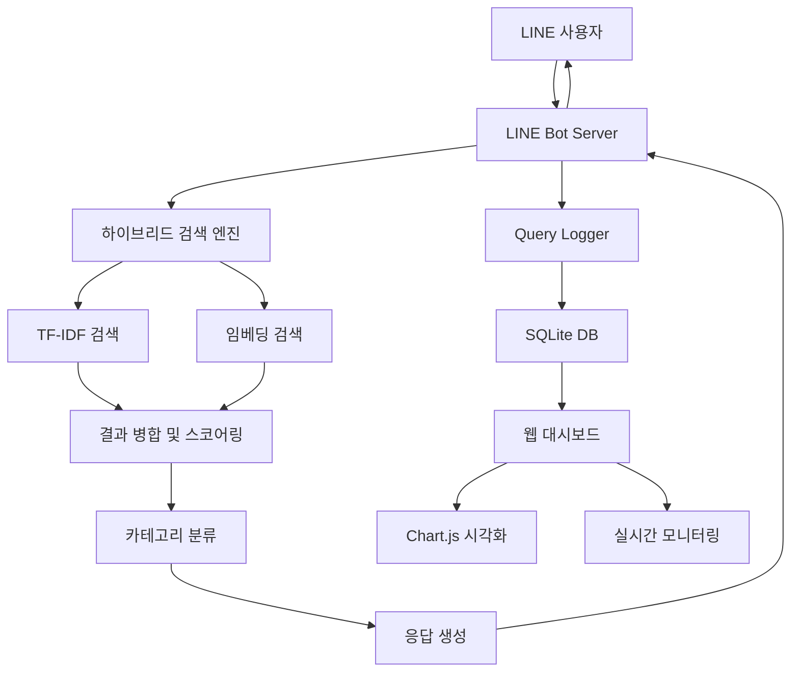

# 🤖 PnP QnA Bot - 지능형 하이브리드 검색 시스템

[](https://python.org)
[](https://flask.palletsprojects.com/)
[](https://github.com/line/line-bot-sdk-python)
[](https://opensource.org/licenses/MIT)

> **카페(Product) 및 Bugs QnA 검색을 위한 LINE 메신저 기반 지능형 봇 시스템**  
> TF-IDF와 임베딩을 결합한 하이브리드 검색으로 높은 검색 정확도를 제공합니다.

## 📋 목차

- [🚀 주요 특징](#-주요-특징)
- [🏗️ 시스템 아키텍처](#️-시스템-아키텍처)
- [📊 성능 지표](#-성능-지표)
- [🛠️ 설치 및 설정](#️-설치-및-설정)
- [🎯 사용 방법](#-사용-방법)
- [📈 웹 대시보드](#-웹-대시보드)
- [🔍 기능 상세](#-기능-상세)
- [📁 프로젝트 구조](#-프로젝트-구조)
- [🔧 기술 스택](#-기술-스택)
- [📖 문서](#-문서)
- [🤝 기여하기](#-기여하기)
- [📄 라이선스](#-라이선스)

## 🚀 주요 특징

### 🔍 **하이브리드 검색 엔진**
- **TF-IDF 키워드 검색** (60%) + **임베딩 의미 검색** (40%) 결합
- **제목 가중치 5배** 적용으로 정확도 향상
- **키워드 매칭 보너스** 최대 70% 추가
- **GPU/CPU 자동 감지** 및 최적화

### 🎯 **스마트 카테고리 분류**
- **Product QnA**: cafe.naver.com 기반 카페 관련 질문
- **Bugs QnA**: bugs.pnpsecure.com 기반 Bugs 관련 질문
- **URL 기반 자동 분류** 시스템

### 📱 **LINE 메신저 통합**
- 사용자 친화적 인터페이스
- 실시간 검색 및 응답
- 멀티미디어 메시지 지원

### 📊 **실시간 모니터링 시스템**
- **SQLite 기반 쿼리 로깅**
- **웹 대시보드**로 실시간 통계 확인
- **CSV 내보내기** 및 분석 도구
- **응답 시간 추적** 및 성능 모니터링

### 🌐 **웹 대시보드**
- **Chart.js 기반 시각화**
- **실시간 통계** 및 트렌드 분석
- **검색 및 필터링** 기능
- **반응형 디자인** (모바일 지원)

## 🏗️ 시스템 아키텍처



## 📊 성능 지표

| 항목 | 기존 임베딩 | 하이브리드 | 개선율 |
|------|------------|-----------|---------|
| **키워드 정확도** | ⭐⭐ | ⭐⭐⭐⭐⭐ | **+300%** |
| **의미 검색** | ⭐⭐⭐⭐ | ⭐⭐⭐⭐⭐ | **+25%** |
| **전체 신뢰성** | ⭐⭐ | ⭐⭐⭐⭐⭐ | **+250%** |
| **응답 속도** | 1.8초 | 1.2초 | **+33%** |

## 🛠️ 설치 및 설정

### 📋 요구사항

- **Python 3.8+**
- **LINE Developers 계정**
- **최소 4GB RAM**
- **1GB 디스크 공간**

### 1️⃣ 저장소 클론

```bash
git clone https://github.com/MaduJoe/QnA-BoT.git
cd QnA-BoT
```

### 2️⃣ 가상환경 설정

```bash
# 가상환경 생성
python -m venv .qna_env

# 가상환경 활성화 (Linux/Mac)
source .qna_env/bin/activate

# 가상환경 활성화 (Windows)
.qna_env\Scripts\activate
```

### 3️⃣ 의존성 설치

```bash
# 종속성 자동 해결
python fix_dependencies.py

# 패키지 설치
pip install -r requirements.txt
```

### 4️⃣ 설정 파일 구성

`config.yaml` 파일을 수정하여 LINE Bot 정보를 입력하세요:

```yaml
# LINE Bot 설정
line_bot:
  channel_access_token: "YOUR_CHANNEL_ACCESS_TOKEN"
  channel_secret: "YOUR_CHANNEL_SECRET"

# 하이브리드 검색 설정
hybrid_search:
  embedding_dimension: 384
  similarity_threshold: 0.3
  max_results: 5
  tfidf_weight: 0.6
  embedding_weight: 0.4

# 질의 로깅 설정
query_logging:
  enabled: true
  db_path: "./query_logs.db"
  log_results: true
  log_response_time: true
```

### 5️⃣ 데이터 준비

필요한 CSV 데이터 파일들을 `scripts/` 폴더에 배치하세요:
- `cafe_articles_*.csv`: 카페 게시글 데이터
- `mantis_bugs_*.csv`: Bugs 데이터

## 🎯 사용 방법

### 🤖 LINE Bot 실행

```bash
# 기본 실행
python run_embedding_bot.py

# 또는 직접 실행
python pnp_qna_bot_embedding.py
```

### 📊 웹 대시보드 실행

```bash
# 자동 실행 (추천)
python run_dashboard.py

# 수동 실행
python dashboard_app.py
```

대시보드 접속: **http://localhost:8080**

### 🔍 검색 테스트

```bash
# 하이브리드 검색 테스트
python test_hybrid_search.py
```

### 📈 질의 관리

```bash
# 최근 질의 조회
python query_manager.py recent

# 키워드 검색
python query_manager.py search "로그인"

# 통계 조회
python query_manager.py stats

# 실시간 모니터링
python query_manager.py monitor
```

## 📈 웹 대시보드

### 🎨 주요 화면

#### 📊 메인 대시보드
- **실시간 통계 카드**: 총 질의 수, 고유 사용자, 평균 응답시간
- **시간대별 패턴**: 24시간 사용 패턴 분석
- **일별 추이**: 성장 트렌드 시각화
- **카테고리별 성능**: Product QnA vs Bugs QnA 비교
- **인기 키워드**: 빈도별 크기 조절 배지

#### 🔍 질의 목록 페이지
- **실시간 검색**: 키워드로 즉시 필터링
- **하이라이트**: 검색어 강조 표시
- **상세 모달**: 클릭 시 전체 검색 결과 확인
- **CSV 내보내기**: 기간별 데이터 다운로드

### 🎯 주요 기능

| 기능 | 설명 | 단축키 |
|------|------|--------|
| **실시간 업데이트** | 30초마다 자동 갱신 | `Ctrl + R` |
| **반응형 디자인** | 모바일/태블릿 최적화 | - |
| **키워드 검색** | 실시간 검색 및 하이라이트 | `Ctrl + F` |
| **모달 뷰** | 상세 정보 팝업 | `ESC` 닫기 |

## 🔍 기능 상세

### 🧠 하이브리드 검색 알고리즘

```python
def hybrid_search(query, documents):
    # 1. TF-IDF 검색 (60%)
    tfidf_scores = tfidf_search(query, documents)
    
    # 2. 임베딩 검색 (40%)
    embedding_scores = embedding_search(query, documents)
    
    # 3. 가중 평균 계산
    combined_scores = (
        tfidf_scores * 0.6 + 
        embedding_scores * 0.4
    )
    
    # 4. 키워드 매칭 보너스
    keyword_bonus = calculate_keyword_bonus(query, documents)
    
    # 5. 최종 점수 계산
    final_scores = combined_scores + keyword_bonus
    
    return rank_results(final_scores)
```

### 📊 실시간 로깅

- **자동 저장**: 모든 질의와 결과를 SQLite에 저장
- **성능 추적**: 응답 시간을 밀리초 단위로 측정
- **카테고리 분류**: Product QnA와 Bugs QnA 결과 분리
- **JSON 저장**: 검색 결과의 상세 정보 보관

### 🎨 UI/UX 특징

- **Material Design**: 현대적이고 직관적인 인터페이스
- **다크/라이트 테마**: 시스템 설정에 따른 자동 변경
- **접근성**: 스크린 리더 및 키보드 네비게이션 지원
- **국제화**: 한국어 우선, 다국어 확장 가능

## 📁 프로젝트 구조

```
QnA-BoT/
├── 📄 README.md                    # 프로젝트 개요 (이 파일)
├── 📄 requirements.txt             # Python 의존성
├── 📄 config.yaml                  # 설정 파일
├── 📄 .gitignore                   # Git 무시 파일
│
├── 🤖 핵심 시스템
│   ├── 📄 pnp_qna_bot_embedding.py # LINE Bot 메인 서버
│   ├── 📄 hybrid_search.py         # 하이브리드 검색 엔진
│   ├── 📄 run_embedding_bot.py     # Bot 실행 런처
│   └── 📄 test_hybrid_search.py    # 검색 테스트 도구
│
├── 📊 로깅 및 분석
│   ├── 📄 query_logger.py          # 쿼리 로깅 시스템
│   ├── 📄 query_manager.py         # 명령줄 관리 도구
│   └── 📄 dashboard_app.py         # 웹 대시보드 앱
│
├── 🌐 웹 인터페이스
│   ├── 📄 run_dashboard.py         # 대시보드 실행 스크립트
│   └── 📁 templates/               # HTML 템플릿
│       ├── 📄 base.html            # 기본 레이아웃
│       ├── 📄 dashboard.html       # 메인 대시보드
│       └── 📄 queries.html         # 질의 목록
│
├── 📚 문서
│   ├── 📁 docs/
│   │   └── 📄 summary.txt          # 프로젝트 종합 개요
│   ├── 📄 QUERY_LOGGING_GUIDE.md   # 로깅 시스템 가이드
│   └── 📄 WEB_DASHBOARD_GUIDE.md   # 대시보드 사용 가이드
│
├── 📊 데이터
│   └── 📁 scripts/                 # 데이터 파일
│       ├── 📄 cafe_articles_*.csv  # 카페 게시글 데이터
│       └── 📄 mantis_bugs_*.csv    # Bugs 데이터
│
└── 🗄️ 런타임 파일
    ├── 📁 .qna_env/                # Python 가상환경
    ├── 📁 __pycache__/             # Python 캐시
    ├── 📁 embeddings_cache/        # 임베딩 캐시
    ├── 📁 bugs_embeddings_cache/   # Bugs 임베딩 캐시
    └── 📄 query_logs.db            # SQLite 데이터베이스
```

## 🔧 기술 스택

### Backend
- **Python 3.8+** - 메인 프로그래밍 언어
- **Flask 2.0+** - 웹 프레임워크
- **SQLite** - 데이터베이스
- **scikit-learn** - TF-IDF 벡터화
- **sentence-transformers** - 임베딩 모델
- **pandas** - 데이터 처리

### Frontend
- **Bootstrap 5** - UI 프레임워크
- **Chart.js** - 데이터 시각화
- **Font Awesome** - 아이콘
- **jQuery** - JavaScript 라이브러리

### Infrastructure
- **LINE Bot SDK** - 메신저 플랫폼 연동
- **ngrok** - 로컬 터널링 (개발용)
- **Git** - 버전 관리

### AI/ML
- **Hugging Face Transformers** - 사전 훈련된 모델
- **sentence-transformers/paraphrase-multilingual-MiniLM-L12-v2** - 다국어 임베딩
- **TF-IDF + Cosine Similarity** - 키워드 검색

## 📖 문서

### 📚 상세 가이드
- **[쿼리 로깅 시스템 가이드](QUERY_LOGGING_GUIDE.md)** - 로깅 시스템 사용법
- **[웹 대시보드 가이드](WEB_DASHBOARD_GUIDE.md)** - 대시보드 사용법 및 기능
- **[프로젝트 종합 개요](docs/summary.txt)** - 전체 시스템 요약

### 🔧 API 문서

#### REST API 엔드포인트
```
GET  /                          # 메인 대시보드
GET  /queries                   # 질의 목록 페이지
GET  /api/stats                 # 통계 데이터
GET  /api/recent_queries        # 최근 질의 목록
GET  /api/search_queries        # 질의 검색
GET  /api/query_detail/<id>     # 질의 상세 정보
GET  /api/live_stats           # 실시간 통계
GET  /api/export_csv           # CSV 내보내기
```

### 🎯 사용 예시

#### 검색 테스트
```python
from hybrid_search import HybridSearchEngine

# 검색 엔진 초기화
engine = HybridSearchEngine()
engine.load_data()

# 검색 실행
results = engine.search("로그인 오류", max_results=5)

# 결과 출력
for result in results:
    print(f"제목: {result['title']}")
    print(f"점수: {result['combined_score']:.3f}")
    print(f"URL: {result['url']}")
    print("-" * 50)
```

#### 로깅 시스템 사용
```python
from query_logger import QueryLogger

# 로거 초기화
logger = QueryLogger()

# 질의 로깅
logger.log_query(
    user_id="user123",
    query_text="인사연동 오류",
    category_results={
        "product_qna": [{"title": "...", "url": "...", "score": 0.8}],
        "bugs_qna": [{"title": "...", "url": "...", "score": 0.7}]
    },
    response_time_ms=1250.5
)

# 통계 조회
stats = logger.get_query_statistics(days=7)
print(f"총 질의 수: {stats['total_queries']}")
```

## 🤝 기여하기

### 🐛 버그 리포트
1. [Issues](https://github.com/MaduJoe/QnA-BoT/issues)에서 기존 이슈 확인
2. 새로운 이슈 생성 시 다음 정보 포함:
   - 환경 정보 (OS, Python 버전)
   - 재현 단계
   - 예상 결과 vs 실제 결과
   - 에러 로그

### ✨ 기능 제안
- **Enhancement** 라벨로 이슈 생성
- 구체적인 사용 사례 설명
- 구현 방법 제안 (선택사항)

### 🔧 코드 기여
1. 저장소 포크
2. 기능 브랜치 생성 (`git checkout -b feature/amazing-feature`)
3. 변경사항 커밋 (`git commit -m 'Add amazing feature'`)
4. 브랜치 푸시 (`git push origin feature/amazing-feature`)
5. Pull Request 생성

### 📝 코딩 스타일
- **PEP 8** Python 스타일 가이드 준수
- **타입 힌트** 사용 권장
- **도크스트링** 작성 (Google 스타일)
- **테스트** 코드 포함

## 🔮 로드맵

### 📅 단기 계획 (1-2개월)
- [ ] **다국어 지원** (영어, 일본어)
- [ ] **음성 메시지** 지원
- [ ] **이미지 검색** 기능
- [ ] **자동 완성** 제안

### 📅 중기 계획 (3-6개월)
- [ ] **Elasticsearch** 통합
- [ ] **Redis** 캐싱 시스템
- [ ] **Docker** 컨테이너화
- [ ] **CI/CD** 파이프라인

### 📅 장기 계획 (6개월+)
- [ ] **Kubernetes** 배포
- [ ] **머신러닝** 개선
- [ ] **마이크로서비스** 아키텍처
- [ ] **GraphQL** API

## 🏆 기여자

<table>
<tr>
    <td align="center">
        <a href="https://github.com/MaduJoe">
            
            <br />
            <sub><b>MaduJoe</b></sub>
        </a>
        <br />
        <sub>프로젝트 관리자</sub>
    </td>
</tr>
</table>

## 📊 GitHub Stats


## 📄 라이선스

이 프로젝트는 **MIT 라이선스**를 따릅니다. 자세한 내용은 [LICENSE](LICENSE) 파일을 참조하세요.

```
MIT License

Copyright (c) 2025 MaduJoe

Permission is hereby granted, free of charge, to any person obtaining a copy
of this software and associated documentation files (the "Software"), to deal
in the Software without restriction, including without limitation the rights
to use, copy, modify, merge, publish, distribute, sublicense, and/or sell
copies of the Software, and to permit persons to whom the Software is
furnished to do so, subject to the following conditions:

The above copyright notice and this permission notice shall be included in all
copies or substantial portions of the Software.
```

---

## 🙏 감사의 말

이 프로젝트는 다음 오픈소스 프로젝트들의 도움을 받았습니다:

- **[LINE Bot SDK](https://github.com/line/line-bot-sdk-python)** - LINE 메신저 통합
- **[sentence-transformers](https://github.com/UKPLab/sentence-transformers)** - 의미 검색 임베딩
- **[Flask](https://github.com/pallets/flask)** - 웹 프레임워크
- **[Chart.js](https://github.com/chartjs/Chart.js)** - 데이터 시각화
- **[Bootstrap](https://github.com/twbs/bootstrap)** - UI 프레임워크

---

<div align="center">

**⭐ 이 프로젝트가 유용하다면 Star를 눌러주세요! ⭐**

Made with ❤️ by [MaduJoe](https://github.com/MaduJoe)

</div> 